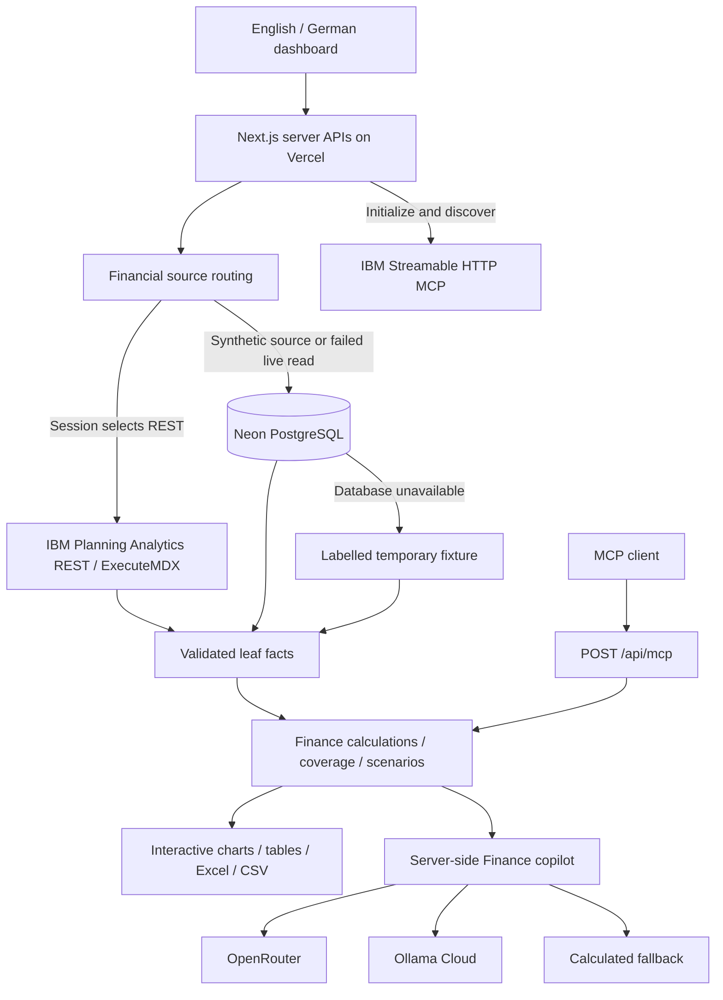
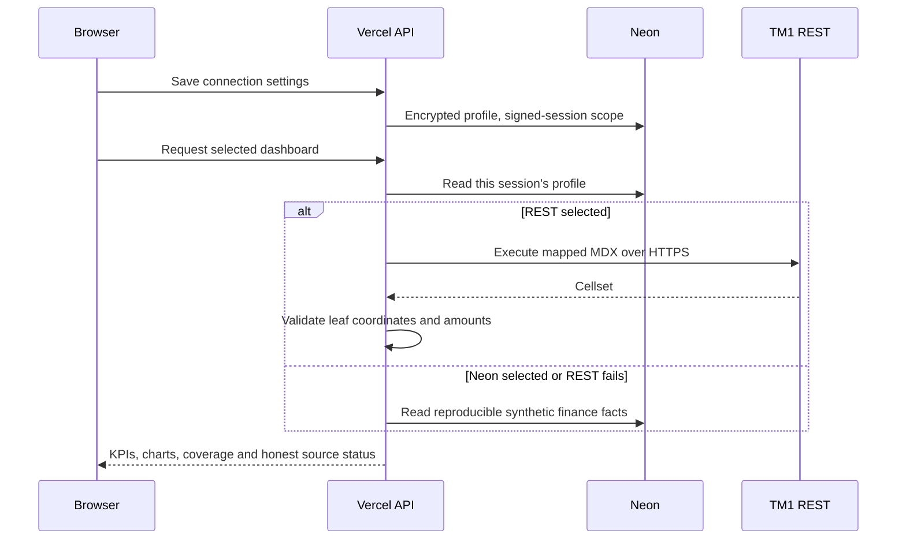

# TalentPlan — financial planning POC

TalentPlan connects revenue, workforce and operating expenses in a financial planning workspace for a recruitment marketplace. The POC provides a working application and a defined integration path to IBM Planning Analytics: validated TM1 REST data activates live reporting; otherwise realistic, reproducible synthetic facts remain available from Neon.

**[Open the application](https://talentplan-tm1.vercel.app/) · [GitHub repository](https://github.com/sohampatra3/talentplan-tm1) · [User guide](docs/USER_GUIDE.md) · [Financial model contract](docs/TM1_MODEL.md)**

The seed contains fictional data, not StepStone financial results or employee records. The application can be adapted to an organisation's financial model by mapping its cube, reporting scope and authentication. Its source status always identifies which data is being used.

## What you can do

| Workspace         | Controls and output                                                                                                |
| ----------------- | ------------------------------------------------------------------------------------------------------------------ |
| Overview          | Revenue, EBITDA, margin and average FTE; annual trend; product mix; market drilldown                               |
| Variance analysis | Budget or Forecast comparison; account selection; favourable EBITDA contribution                                   |
| Workforce         | Department drilldown; personnel expense or average FTE; chart selection                                            |
| Scenario lab      | Revenue, salary and additional FTE assumptions; calculated preview; saved alternatives in Neon                     |
| TM1 explorer      | Version/account selectors; paginated, validated leaf facts                                                         |
| Finance copilot   | Public chat through OpenRouter, Ollama Cloud or calculated analysis; written answer and optional visual workspace  |
| Visual analysis   | Separate chart builder with reporting filters, metric, grouping, version, chart type, data table and CSV download  |
| Connections       | Appearance settings; session-specific REST/MCP endpoints and credentials; REST verification and MCP tool discovery |
| User guide        | Practical navigation and financial definitions                                                                     |

The workspace opens in **light mode** with the **Sage** theme, independently of the device's color preference. The top controls switch **English/German** and **light/dark mode**. Use the palette icon or **Connections → Appearance settings** to choose Sage (green and golden accents) or Glass (frosted surfaces with blue and lilac tones). Both themes support light and dark mode. Choices apply immediately and persist in the browser; **Restore defaults** returns to light Sage. Previously automatic dark preferences are reset once with this update. A shared reporting scope selects year, month range, entity, department and Budget/Forecast comparison. Selected exports use that scope; **All data** exports every available source fact. Canonical cube coordinates in exports remain stable for reconciliation.

## Architecture

One Next.js application contains the interface, APIs, financial calculations and connection adapters. Vercel hosts the application and Neon stores finance facts, private scenarios, encrypted connection profiles and AI quota reservations. There is no separate Python service.





### Storage

| Table                | Purpose                                                                   |
| -------------------- | ------------------------------------------------------------------------- |
| `finance_fact`       | Typed period/entity/department/product/account/version facts              |
| `scenario`           | Saved assumptions, recomputed financial results, source and session owner |
| `ai_usage`           | Transactional reservation of paid provider calls                          |
| `connection_profile` | AES-256-GCM encrypted REST/MCP settings, one profile per signed session   |

Connection secrets are encrypted before database storage and never returned by the settings API. Encryption binds the profile to its session identifier. Keep `SESSION_SECRET` stable; replacing it invalidates existing sessions and the connection encryption key. Browser sessions last seven days and are refreshed by normal use. They provide private POC workspaces; enterprise identity and permissions can be integrated when adopting the application.

## Financial data and conventions

The deterministic seed creates **3,450 facts**, covering 2025 and 2026, Germany and the United Kingdom, four departments, three revenue products, and Actual/Budget/Forecast. Synthetic Actuals end in **September 2026**; Budget and Forecast cover the full year. The default scope is January–September 2026, all entities and departments, EUR.

Revenue drivers include paid listings, employer subscriptions and talent services. Personnel planning includes monthly average FTE, salary and employer on-costs. Illustrative assumptions include softer Germany Q3 demand, engineering recruitment ahead of plan, employer on-cost pressure and a UK currency cost uplift. These assumptions create explainable financial relationships; they are not verified company events.

| Term                      | Calculation / meaning                                                        |
| ------------------------- | ---------------------------------------------------------------------------- |
| Revenue                   | Sum of the three revenue products                                            |
| Operating expenses / Opex | Personnel + Marketing + Technology + General & Administrative                |
| EBITDA                    | Revenue − Opex; does not include depreciation, amortisation, interest or tax |
| EBITDA margin             | EBITDA ÷ Revenue × 100; zero revenue displays zero                           |
| Numeric variance          | Actual − selected comparison                                                 |
| Favourable contribution   | Revenue: Actual − comparison. Expenses: comparison − Actual                  |
| Average FTE               | Monthly full-time-equivalent totals averaged across represented months       |
| Rolling annual outlook    | Actual at each available leaf coordinate, otherwise its Forecast             |

FTE is additive across entities/departments within a month and averaged over time. Product views show revenue; unallocated costs require an agreed allocation model before product profitability is meaningful. The annual trend and outlook retain the full-year context for the selected entity and department, while KPIs and selected exports use the chosen month range.

The sum of favourable account contributions reconciles to the EBITDA gap. Actual takes precedence only for the **same leaf coordinate**, including genuine zero Actual values. A partial Actual load in one entity does not suppress another entity's Forecast. Budget does not substitute for a missing outlook value.

Coverage warnings identify partial Actual periods and missing outlook coordinates within the returned view. They cannot reveal an account absent from every returned version or certify a financial close. Review MDX scope and source control totals with the model owner. See [the detailed contract](docs/TM1_MODEL.md).

### Scenario calculation

```text
Scenario revenue = Actual revenue × (1 + revenue change %)
Period cost per FTE = Actual personnel expense ÷ Actual average FTE
Scenario personnel = (Actual personnel + additional average FTE × period cost per FTE)
                     × (1 + salary rate change %)
Scenario EBITDA = Scenario revenue − Scenario personnel − other Actual Opex
```

Additional FTE applies throughout the selected period at its blended personnel cost. Individual start dates, vacancies and severance need additional drivers. A saved alternative stores its reporting scope and assumptions. **Apply assumptions** reuses the saved drivers in the current scope. Scenarios remain separate from source facts and TM1 cells.

## Copilot and visual analysis

Anyone with the deployed link can use configured cloud providers without entering an access code. Provider credentials remain in Vercel server environment settings. The UI exposes provider names and availability only.

Select **Written answer** or **Answer + visualization**. The second option opens a separate interactive analysis workspace after the response. Each answer also offers **Open visual analysis**. Change the metric, grouping, version, filters or chart type, inspect the matching table and download chart data. Choose Rolling outlook for all twelve months with coordinate-level Actual/Forecast precedence; its month controls are disabled and the annual scope is stated. Visualisation suggestions map the question to a supported financial view; every plotted number is computed from validated facts, rather than generated by a language model.

OpenRouter uses its chat-completions API; Ollama Cloud uses its direct cloud chat API. Providers receive the selected financial summary and recent conversation context, not connection credentials. Replies follow the selected English/German language. The application labels calculated responses and provider failures explicitly.

Paid calls are limited to **15 per browser session and 100 globally in 24 hours**, with quota reserved transactionally in Neon. Calculated analysis remains available when cloud services are unavailable or quotas are exhausted. Provider configuration can be changed on the server without exposing model identifiers in the interface.

## Connect IBM Planning Analytics

Open **Connections** in the application. These settings affect your browser session only.

1. Enter the public HTTPS TM1 REST root, normally ending in `/api/v1`.
2. Choose the authentication supported by your IBM gateway: username/password, IBM API key, or bearer/OAuth access token.
3. Supply an MDX view returning one numeric column and six canonical row dimensions: Period, Entity, Department, Product, Account and Version.
4. Use **Test REST data** to verify an actual, validated cellset. The supplied sample verifies one leaf; expand it to the required annual reporting scope.
5. Select **TM1 REST** as the active financial source and save. The dashboard activates live data only after a successful read. A failed read displays an unavailable TM1 status and falls back to labelled synthetic data.
6. Enter your IBM MCP Streamable HTTP endpoint and its authentication. **Connect & discover tools** performs protocol initialisation and `tools/list`, displaying names, schemas and read-only hints.

Current IBM documentation describes a unified **`/ibm-pa-tools/mcp`** endpoint. The full URL and entitlement depend on your IBM deployment; supply the endpoint issued for your environment. MCP settings discover IBM tools; the dashboard's financial source is the mapped REST connection. Discovery does not execute IBM tools or perform writeback. OAuth access tokens can be supplied; automatic OAuth sign-in/refresh is an extension point.

User-entered endpoints require public HTTPS, verified TLS and public DNS addresses. The adapter pins validated DNS resolutions, rejects redirects and limits responses to 4 MiB. Private-network TM1 installations can use an approved public gateway or a future private-network deployment of the adapter. The temporary REST cellset is deleted after reading.

The built-in **application MCP server** is separate from the IBM connection. Connect a Streamable HTTP client to:

```text
https://talentplan-tm1.vercel.app/api/mcp
```

It exposes three read-only tools: `finance_summary`, `finance_facts` (up to 100 matching rows) and `finance_source_status`. Its default public dataset is the server's financial source, currently synthetic Neon data. A client with an authorised signed session can use that session's selected REST source. Endpoints and the data route are displayed in Connections.

### TM1 implementation sources

- [Financial model contract](docs/TM1_MODEL.md): cube grain, aggregation, coverage and integration design.
- [MDX template](tm1/finance-view.mdx): canonical leaf read.
- [Rules / feeders](tm1/Finance_Drivers.rux): driver-based revenue and personnel calculations.
- [TurboIntegrator template](tm1/load-finance.ti): validation, controlled loading and reconciliation.

The adapters and web calculations are implemented. Apply and validate the IBM templates in the target licensed environment when integrating its cube. The application does not claim that the templates have run on an IBM server.

## Development and deployment

Use Node.js **24 LTS** and npm. Create `.env.local` from `.env.example` and supply database URLs plus a strong random session secret privately.

```bash
npm ci
cp .env.example .env.local
npm run db:setup
npm run dev
```

`db:setup` applies versioned SQL and loads reproducible facts transactionally. Re-running it does not replace existing facts. There is no public database seed/reset endpoint.

```bash
npm run verify
npx tsx scripts/verify-api.ts http://localhost:3000
```

The verification suite checks finance reconciliation, coordinate-level forecasts, FTE, reporting filters, connection isolation, credential masking, endpoint validation, exports and the MCP protocol. The API script verifies database-backed behaviour and calculated chat without making paid calls.

| Setting                                                         | Purpose                                                                                           |
| --------------------------------------------------------------- | ------------------------------------------------------------------------------------------------- |
| `DATABASE_URL`                                                  | Pooled Neon URL, server only                                                                      |
| `DATABASE_URL_UNPOOLED`                                         | Direct connection for database setup                                                              |
| `SESSION_SECRET`                                                | Stable secret for signed sessions and connection encryption                                       |
| `OPENROUTER_API_KEY`, `OLLAMA_API_KEY`                          | Optional cloud credentials, server only                                                           |
| `OPENROUTER_MODEL`, `OLLAMA_MODEL`                              | Internal provider configuration, hidden from the UI                                               |
| `APP_ACCESS_PASSWORD`                                           | Optional whole-application gate; required for globally configured live finance                    |
| `TM1_URL`, `TM1_USER`, `TM1_PASSWORD`, `TM1_API_KEY`, `TM1_MDX` | Optional global server REST configuration; browser-specific settings are available in Connections |

CAM/SSO authentication and corporate cube layouts should be mapped to the target organisation. The UI currently supports the fixture's 2025/2026 reporting horizon; extend its metadata for a different horizon. Adopting real finance data should include approved SSO/RBAC, retention, audit and reconciliation policies. The existing APIs and adapter boundary provide the integration points.

The app is deployed to Vercel, with source on GitHub and Neon in Frankfurt. **Production updates are currently deployed manually.** The repository's GitHub Actions workflow runs tests, type checking and a build. Automatic Vercel deployment requires approving the Vercel GitHub app and connecting this repository to the Vercel project.

```bash
vercel link --project talentplan-tm1 --scope YOUR_SCOPE
vercel --prod
```

The public POC uses a synthetic database shared by production and preview. Use isolated Neon branches/environments for real data or schema changes. Keep API keys, tokens, connection passwords and `.env.local` out of Git.

## Application APIs

| Endpoint                                        | Purpose                                                  |
| ----------------------------------------------- | -------------------------------------------------------- |
| `GET /api/dashboard`                            | Financial summary, chart series, coverage, active source |
| `GET /api/analysis`                             | Deterministic metric/group/version analysis              |
| `GET /api/explorer`                             | Paginated leaf facts by version/account                  |
| `GET /api/export?format=xlsx&scope=all`         | Excel or CSV; selected or complete source scope          |
| `GET /api/scenarios`, `POST /api/scenarios`     | Session-private planning alternatives                    |
| `GET /api/connections`, `POST /api/connections` | Sanitised settings, save, REST test, MCP discovery       |
| `GET /api/copilot`, `POST /api/copilot`         | Provider availability and public finance chat            |
| `POST /api/mcp`                                 | Streamable HTTP read-only finance tools                  |

Reporting parameters: `year`, `fromMonth`, `toMonth`, `entity`, `department`, `comparison`. Analysis adds `metric`, `dimension`, `version`. Browser write endpoints require a matching Origin. Parameterised SQL, signed HttpOnly cookies, encrypted connection secrets and CSV formula escaping support reliable integration. Scenario limits are 20 per session and 300 globally per 24 hours.

## Primary references

- [IBM Planning Analytics: Assistant MCP tools](https://www.ibm.com/docs/en/planning-analytics/3.1.0?topic=assistant-mcp-tools)
- [IBM official MCP registry](https://github.com/IBM/mcp)
- [IBM: unified MCP endpoint and TM1 Metrics API](https://www.ibm.com/support/pages/node/7276340)
- [IBM TM1 REST cellsets](https://www.ibm.com/docs/SSD29G_2.0.0/com.ibm.swg.ba.cognos.tm1_rest_api.2.0.0.doc/t_tm1_rest_api_cellsets.html)
- [IBM rules, SKIPCHECK and feeders](https://www.ibm.com/docs/en/planning-analytics/2.0.0?topic=rules-components-rule)
- [MCP Streamable HTTP specification](https://modelcontextprotocol.io/specification/2025-06-18/basic/transports)
- [Ollama Cloud](https://docs.ollama.com/cloud)
- [Neon and Vercel](https://neon.tech/docs/guides/vercel-native-integration)

MIT licensed. See [LICENSE](LICENSE).
