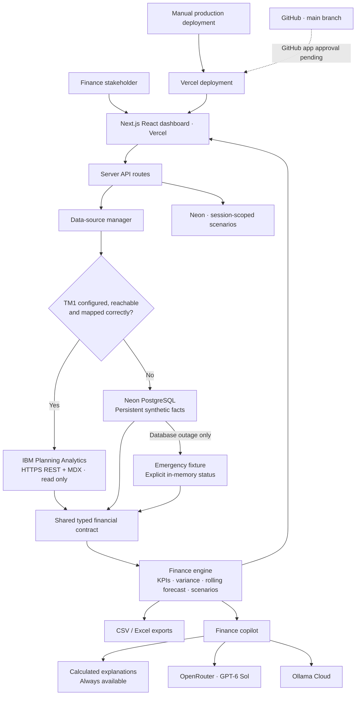
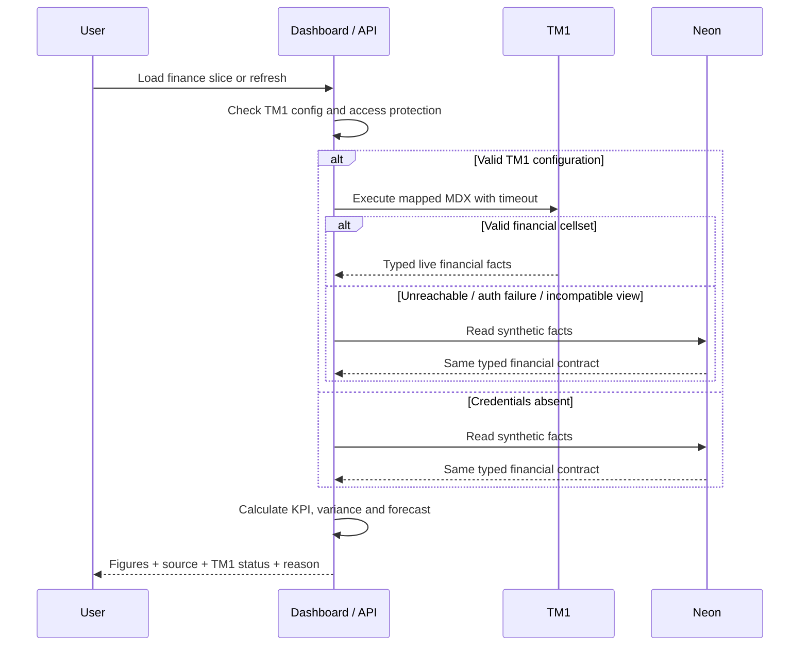
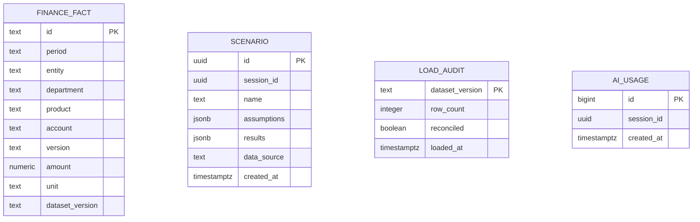

# TalentPlan — Finance, in focus

A TM1-ready financial planning and workforce analytics application for a fictional recruitment marketplace. Built as an independent portfolio proof of concept for a StepStone TM1 developer interview.

**[Open the dashboard](https://talentplan-tm1.vercel.app)** · **[Source code](https://github.com/sohampatra3/talentplan-tm1)**

> **Data disclosure:** All demo figures are synthetic. TalentPlan is fictional. This project is not affiliated with StepStone or IBM and does not represent StepStone financial results, employees, or internal architecture. The live TM1 connector is implemented, but has not been validated against a licensed IBM environment. TM1 example sources are reviewable templates, not evidence of executed TM1 development.

## What you can demonstrate

| View               | Stakeholder question                 | Capability                                                                                     |
| ------------------ | ------------------------------------ | ---------------------------------------------------------------------------------------------- |
| Overview           | How are we performing?               | Revenue, EBITDA, EBITDA margin, average FTE, monthly trend, product mix and market comparisons |
| Variance analysis  | Why are we behind plan?              | Actual versus Budget, favourable/adverse signs and contribution to the EBITDA gap              |
| Workforce          | How does hiring affect cost?         | Department FTE and personnel expense; employer on-cost and FX assumptions                      |
| Scenario lab       | What if we change the plan?          | Revenue, salary and FTE sensitivity; persistent scenarios in Neon                              |
| TM1 explorer       | Can I trace the number?              | Period, Entity, Department, Product, Account and Version slices; paginated source records      |
| Finance copilot    | Can you explain the evidence?        | Deterministic finance explanations, OpenRouter GPT-6 Sol and Ollama Cloud options              |
| Connections        | Where are these figures coming from? | Explicit TM1 status, active source, fallback reason and database health                        |
| Presentation guide | How do I present this?               | A five-minute tour and finance/TM1 terminology                                                 |

Download either the selected slice or **all 3,450 demo records** in CSV or an Excel workbook. Excel includes provenance, aggregation notes, a dashboard summary and filterable finance facts. Scenario records are a separate planning store; they are not part of the source-facts export.

## Architecture

One Next.js application owns the React dashboard, backend endpoints, finance calculations and source routing. It is deployed on Vercel with the database and application functions in Frankfurt. This simplifies the original React/Vite + FastAPI idea to a single deployment. TM1 is reached directly through its REST API, so no Python runtime or TM1py dependency is required by the deployed application.





### Source behaviour

| Condition                                    | Dashboard                                             | Source                                    |
| -------------------------------------------- | ----------------------------------------------------- | ----------------------------------------- |
| Missing TM1 URL/authentication/mapping       | **TM1 disconnected** plus reason                      | Neon synthetic facts                      |
| Connection timeout/network/HTTP server error | **TM1 not reachable** plus reason                     | Neon synthetic facts                      |
| Authentication or schema error               | Disconnected banner; detailed error in Connections    | Neon synthetic facts                      |
| Valid mapped cellset                         | **TM1 connected — Live TM1**                          | IBM Planning Analytics                    |
| Neon unavailable during fallback             | Explicit Neon unavailable / temporary fixture message | In-memory synthetic data; saving disabled |

The switch runs on **every finance data request**, rather than only at application startup. No green TM1 badge is shown just because credentials exist. The MDX read and financial contract must succeed. Returning live mode requires configuring `APP_ACCESS_PASSWORD` so actual financial data is protected.

## Finance model and synthetic data

The deterministic seed produces **3,450 records**, two entities (Germany and United Kingdom), four departments, three revenue products, and three versions. It covers 2025 and 2026. Actuals stop at **September 2026**; Budget and Forecast cover all twelve months. Default dashboard: January–September 2026, all entities, EUR.



The database uses positive values for income and expenses. All monetary amounts report in EUR. No employee personal data is generated. UK costs incorporate a documented illustrative currency assumption; this POC is not a transaction-level FX consolidation system.

### Core definitions

| Term                        | Definition in this model                                                                                    |
| --------------------------- | ----------------------------------------------------------------------------------------------------------- |
| FP&A                        | Financial planning and analysis: budgets, forecasts, scenarios and performance review                       |
| Earned revenue              | Fulfilled paid listings × net price, plus active employer subscriptions × monthly price and talent services |
| Operating expenses / Opex   | Personnel + Marketing + Technology + General & Administrative                                               |
| EBITDA                      | Revenue − Opex; no depreciation, amortisation, interest or tax accounts are modelled                        |
| EBITDA margin               | EBITDA ÷ revenue × 100; zero revenue produces a zero presentation value                                     |
| Actual − Budget             | Numeric variance before financial favourability is applied                                                  |
| Favourable revenue variance | Actual − Budget                                                                                             |
| Favourable expense variance | Budget − Actual; lower expense is favourable                                                                |
| FTE                         | Full-time-equivalent capacity, **averaged over months** and added across entities/departments               |
| Rolling full-year forecast  | Actual at each available leaf coordinate; otherwise its matching Forecast, across the full year             |
| Employer on-costs           | Employer costs above gross salary; synthetic Germany Actual 23.5%, Budget 22% in 2026                       |
| Cutover in the demo         | September 2026 is the final closed Actual period; later months contain Forecast only                        |

**Reconciliation:** the sum of individual favourable account variances equals Actual EBITDA minus Budget EBITDA. The database load audit reconciles the seeded record count before commit.

The rolling outlook matches **Period × Entity × Department × Product × Account**. An Actual value replaces only the Forecast at that same leaf coordinate, including a genuine zero Actual. If Germany has Actuals for a month while the UK has Forecast only, both contribute to the outlook. Budget is never substituted for a missing Actual/Forecast value. The annual outlook uses the full returned year even when the KPI cutoff is an earlier month.

The dashboard's **Review data coverage** warning identifies partial Actual periods and an incomplete annual outlook. Expected coordinates are the union of Actual, Budget and Forecast coordinates returned for each month in the selected year/entity scope. A month is partial when only some of those coordinates have Actual; it has missing outlook coverage when any expected coordinate has neither Actual nor Forecast, or when no records were returned for that month. The Excel workbook also records these warnings. Missing amounts are not invented, so an incomplete view can understate totals and should be resolved before presenting them as a full-year plan.

Coverage is **relative to the returned MDX scope**, not proof that the source cube or financial close is complete. A view that omits an account from every version cannot reveal that omission. The displayed last returned Actual period is therefore evidence of available data, not confirmation that every entity and account is closed. Validate the MDX scope, close status and control totals with the model owner.

Known business stories: Germany's Q3 paid-listing demand softens; employer subscriptions partially cushion revenue; engineering hires run ahead of plan; Germany employer on-costs rise; UK expenses carry an illustrative 2.5% FX uplift. All assumptions are synthetic and stated as such.

### Scenario formula

```text
Scenario revenue = baseline revenue × (1 + revenue change %)
Period cost per FTE = baseline personnel expense ÷ baseline average FTE
Scenario personnel = (baseline personnel + additional average FTE × period cost per FTE)
                     × (1 + salary rate change %)
Scenario EBITDA = scenario revenue − scenario personnel − other baseline Opex
```

Additional FTE is assumed to apply for the entire selected period, with the baseline blended cost. The simulator does not model individual start dates, severance, vacancies, or changes in other expenses. Scenarios are isolated records; they do not overwrite Budget, Actual or TM1 cells. A signed HttpOnly cookie scopes saved scenarios to the current browser. This is session isolation for an interview POC, not enterprise user identity or role-based access.

## Dashboard walkthrough

1. Open **Overview** and point out the source banner before presenting numbers.
2. Select the reporting year, YTD cutoff and entity. The twelve-month chart provides annual context; KPIs use the selected YTD slice. Resolve any **Review data coverage** warning before treating the figures as complete.
3. Open **Variance analysis** to explain the EBITDA gap. Read expense favourability separately from numeric Actual − Budget.
4. Open **Workforce** to connect average FTE and employer on-costs to personnel expense.
5. In **Scenario lab**, change revenue, salary or FTE assumptions, name the scenario and save it. Refresh and return to show Neon persistence. Other browser sessions do not see your scenarios.
6. Use **TM1 explorer** to choose Version and Account and page through finance facts.
7. Use **Export data → All data · Excel / CSV** for a complete source dataset, or choose the selected view.
8. Ask **Why is EBITDA below budget?** in the copilot. Choose calculated analysis, OpenRouter or Ollama Cloud. Provider availability and fallback are clearly labelled.
9. Open **Connections** and recheck TM1. Once a mapped IBM environment is configured, the same UI receives live facts.

## Local development

Use Node.js **24 LTS** (Vercel project runtime), npm, and an existing Neon project.

```bash
npm ci
cp .env.example .env.local
# Set DATABASE_URL, DATABASE_URL_UNPOOLED and a random SESSION_SECRET privately.
# Link your own Vercel project before database setup when using the Vercel bootstrap flow.
npm run db:setup
npm run dev
```

Open `http://localhost:3000`. `db:setup` runs the versioned SQL and inserts the reproducible fixtures transactionally. Re-running it does not replace existing facts. There is no public seed/reset endpoint. A new dataset version or changed fixtures should be handled with an explicit migration.

```bash
npm run test       # finance, forecast, FTE, scenario, CSV and TM1 contract checks
npm run typecheck
npm run build
npm run verify    # all of the above
```

### Environment settings

| Variable                    | Required?             | Purpose                                                                      |
| --------------------------- | --------------------- | ---------------------------------------------------------------------------- |
| `DATABASE_URL`              | Yes for persistence   | Pooled Neon connection; server only                                          |
| `DATABASE_URL_UNPOOLED`     | Setup only            | Direct connection for SQL setup; keep out of frontend                        |
| `SESSION_SECRET`            | Production            | Random secret used to sign anonymous scenario cookies                        |
| `OPENROUTER_API_KEY`        | Optional              | Your OpenRouter API credential                                               |
| `OPENROUTER_MODEL`          | Optional              | Defaults to `openai/gpt-6-sol`; high reasoning effort                        |
| `OLLAMA_API_KEY`            | Optional              | Direct Ollama Cloud credential                                               |
| `OLLAMA_MODEL`              | Optional              | Defaults to `gpt-oss:120b`; configurable cloud model                         |
| `COPILOT_ACCESS_TOKEN`      | Cloud AI              | Presenter token required before paid provider calls                          |
| `APP_ACCESS_PASSWORD`       | Required for live TM1 | Basic access gate for the whole application over HTTPS                       |
| `TM1_URL`                   | Optional              | Trusted HTTPS REST root ending in `/api/v1`                                  |
| `TM1_USER` + `TM1_PASSWORD` | Optional              | Native TM1 Basic authentication                                              |
| `TM1_API_KEY`               | Optional              | Bearer credential, only if supported by your IBM gateway                     |
| `TM1_MDX`                   | Required for live TM1 | MDX mapping returning canonical row coordinates and one numeric value column |

`TM1_CUBE` in the example environment is descriptive; the actual cube selection is in `TM1_MDX`. Authentication depends on the IBM hosting/security mode. CAM/SSO installations need an appropriate service identity/gateway extension; a generic API key is not assumed to work on every TM1 installation.

### OpenRouter GPT-6 Sol

The hosted production application has both cloud providers enabled. Open **Finance copilot**, enter your private presenter access code and ask a question. OpenRouter is selected automatically when its key is configured; Ollama Cloud is available in the provider menu. The code and provider keys are stored only in Vercel production secrets and are not included in this repository.

In **Vercel → talentplan-tm1 → Settings → Environment Variables**, add `OPENROUTER_API_KEY` and a private `COPILOT_ACCESS_TOKEN`, then redeploy. The model is already configured as `openai/gpt-6-sol`. In the dashboard select OpenRouter and enter the presenter token. Tokens are held in memory for that component only, not in browser storage. Provider keys are never sent to the browser.

OpenRouter's model catalogue was checked on 4 October 2026. The requested name “GPT-6 Tera” was not listed; **GPT-6 Sol was selected with the project owner's confirmation**. The model ID remains configurable. Requests go to `https://openrouter.ai/api/v1/chat/completions` with calculated evidence and high reasoning effort.

### Ollama Cloud

Add `OLLAMA_API_KEY`, optionally change `OLLAMA_MODEL`, set the same presenter access token and redeploy. Requests use the direct `https://ollama.com/api/chat` endpoint with bearer authentication. A local Ollama server is not required.

The cloud models receive the selected financial summary, not credentials or employee details. Rate limits: 15 provider calls per browser session per 24 hours and 100 globally. Quotas are transactionally reserved in Neon before calling a provider. Provider failures, missing keys or timeouts return an explicit calculated-analysis fallback; they are not displayed as successful AI calls.

## Connect an IBM Planning Analytics environment

1. Use a licensed/reachable environment and a read-only service identity.
2. Set `APP_ACCESS_PASSWORD` before enabling live finance data.
3. Supply the HTTPS REST root and authentication suitable for your environment.
4. Build a cube view matching [the finance contract](docs/TM1_MODEL.md).
5. Adapt [the example MDX](tm1/finance-view.mdx) to your cube and set it as `TM1_MDX`.
6. Redeploy and use **Connections → Recheck connection**. A valid read must succeed before the source becomes live.

The adapter reads a single numeric column and leaf coordinate tuples containing `Period`, `Entity`, `Department`, `Product`, `Account` and `Version`. It validates supported entities, accounts, versions, units, periods and finite numeric values. Account names must match the typed contract. Null or incompatible values produce an explicit fallback. A 6.5-second timeout avoids leaving the dashboard waiting indefinitely; the temporary MDX cellset is cleaned up afterwards. Existing corporate cube names and dimensional layouts require a mapping adaptation; this is not a universal connector to arbitrary TM1 cubes.

A successful read confirms connectivity and contract validity, not a complete reporting view. Include the required entities, accounts, actual periods and forecast horizon in your MDX; use the coverage warnings and source control totals to review the returned scope. [The model contract](docs/TM1_MODEL.md) documents coordinate precedence and the coverage metadata.

### TM1 developer evidence in the repository

- [Model design and contract](docs/TM1_MODEL.md): dimensions, hierarchies, model grain and integration/governance decisions.
- [MDX view template](tm1/finance-view.mdx): one value column, six row coordinate dimensions.
- [Rules/feeder example](tm1/Finance_Drivers.rux): driver-based revenue and personnel planning.
- [TurboIntegrator template](tm1/load-finance.ti): validation, controlled loading and batch reconciliation approach.
- [Presentation notes](docs/PRESENTATION.md): stakeholder script and honest boundaries for the interview.

These examples must be adapted and validated on IBM software before being presented as executed rules, feeders or TI processes. The web finance engine supports the demo while IBM access is unavailable; it does not emulate the IBM calculation engine.

## API

| Endpoint                                                      | Purpose                                                       |
| ------------------------------------------------------------- | ------------------------------------------------------------- |
| `GET /api/dashboard?year=2026&toMonth=9&entity=Germany`       | Finance summary, charts and current source status             |
| `GET /api/explorer?...&version=Actual&account=Revenue&page=1` | Paginated cube slice                                          |
| `GET /api/export?...&format=xlsx&scope=all`                   | Complete dataset workbook; `csv` and selected scope supported |
| `GET /api/scenarios`                                          | Current session's saved scenarios                             |
| `POST /api/scenarios`                                         | Validate and save assumptions, recomputed results and source  |
| `GET /api/copilot`                                            | Provider availability and model names; no keys                |
| `POST /api/copilot?...`                                       | Calculated explanation or protected cloud AI response         |

Write endpoints enforce same-origin requests. Saved-scenario limits: 20 per session and 300 globally per 24 hours. Parameterised SQL, CSV formula-injection escaping, TLS validation, signed cookies, optional application access and server-only secrets are built in. Before a real enterprise rollout, replace shared Basic access and anonymous sessions with an approved SSO/RBAC solution, audit policy and environment-specific TM1 authentication.

## Deployment and repository

The application is live on Vercel from a **manual production deployment**, and the source code is stored in the GitHub repository linked above. Connecting that repository to Vercel is **pending GitHub app approval**. Pushes to `main` do not yet trigger Vercel deployments. GitHub Actions runs finance tests, type checking and a production build independently of that deployment connection.

To enable future automatic deployments, approve or install the Vercel GitHub app for this repository, then open **Vercel → talentplan-tm1 → Settings → Git**, connect `sohampatra3/talentplan-tm1` and select `main` as the production branch. Once the connection is confirmed, pushes to `main` will deploy production and pull requests can create preview deployments. Until then, deploy reviewed changes manually with the command below.

Vercel and Neon are in Frankfurt; production/preview server settings contain the pooled database URL and session secret. This POC shares one synthetic database across production and preview. Use a separate Neon branch for future schema-changing development or real data.

```bash
vercel link --project talentplan-tm1 --scope YOUR_SCOPE
# Configure required environment settings in your own project.
vercel --prod
```

Do not commit `.env.local`, personal access tokens, TM1 passwords, provider keys or database URLs. Keep API credentials in Vercel settings. The CI workflow tests code; after approval, automatic deployments will use the Vercel Git integration rather than a long-lived deploy token in GitHub.

## Alignment with the public StepStone role

The public TM1 vacancy describes Group Finance Solutions work involving IBM Planning Analytics models, TI, rules, MDX, integrations, administration, stakeholder support and documentation. This project demonstrates financial modelling, an integration abstraction, transparent operational status, traceable reporting and stakeholder-friendly explanations. It does not establish the company's full technology stack or substitute for validated IBM authoring experience.

### Primary references

- [StepStone: TM1 Developer vacancy](https://www.stepstone.de/stellenangebote--TM1-Developer-m-f-d-Dusseldorf-The-Stepstone-Group-GmbH--14539106-inline.html)
- [IBM: TM1 REST API cellsets](https://www.ibm.com/docs/SSD29G_2.0.0/com.ibm.swg.ba.cognos.tm1_rest_api.2.0.0.doc/t_tm1_rest_api_cellsets.html)
- [IBM: rule components, SKIPCHECK and feeders](https://www.ibm.com/docs/en/planning-analytics/2.0.0?topic=rules-components-rule)
- [OpenRouter: model catalogue](https://openrouter.ai/api/v1/models)
- [Ollama: direct cloud access](https://docs.ollama.com/cloud)
- [Neon: Vercel integration](https://neon.tech/docs/guides/vercel-native-integration)
- [Next.js: App Router](https://nextjs.org/docs/app)

MIT licensed. See [LICENSE](LICENSE).
