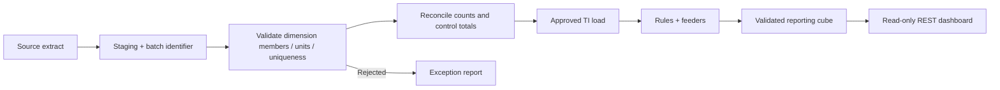

# TM1 model and integration contract

This is a design specification for adapting a licensed IBM environment. Web finance calculations and fixtures are implemented. The TM1 model sources are examples that require authoring and validation in IBM Planning Analytics.

## Canonical reporting cube

`Finance_Plan`: **Period × Entity × Department × Product × Account × Version × Measure**.

| Dimension  | Example leaves                                                                                    | Suggested hierarchy/attributes                                                                                                                  |
| ---------- | ------------------------------------------------------------------------------------------------- | ----------------------------------------------------------------------------------------------------------------------------------------------- |
| Period     | `2026-01` … `2026-12`                                                                             | Year → Quarter → Month; PeriodIndex and Closed attributes                                                                                       |
| Entity     | Germany, United Kingdom                                                                           | Reporting Group; local currency attribute                                                                                                       |
| Department | Commercial, Product & Engineering, Customer Operations, Corporate                                 | All Departments; cost-centre mapping                                                                                                            |
| Product    | Job advertising, Employer subscriptions, Talent solutions, All products                           | All products is a **technical leaf** for unallocated costs in the canonical contract; use a different consolidation name such as Total Products |
| Account    | Revenue, Personnel, Marketing, Technology, General & Administrative, FTE, Listings, Subscriptions | Revenue/Opex/driver subsets; Unit and FavourableDirection attributes                                                                            |
| Version    | Actual, Budget, Forecast                                                                          | Workflow state and owner stored separately                                                                                                      |
| Measure    | Amount_EUR                                                                                        | Canonical numeric measure; the account supplies EUR/FTE/count meaning                                                                           |

The canonical contract deliberately carries only supported leaf coordinates. The web finance layer sums additive amounts and divides monthly FTE totals by the number of represented periods. It does not sum ratios or FTE across time. Accounts outside the contract need an explicit mapping change.

The numeric column has the technical name `Amount_EUR` for the interface, but FTE/count accounts retain their non-currency units. A production model may use a better named `Value` measure or separate measure groups; adapt the MDX column accordingly. The adapter does not inspect the numeric column's member name, only that exactly one column exists.

## Separate driver cube for rule examples

`Finance_Drivers`: **Period × Entity × Version × Finance_Measure**.

Measures: Listing_Volume, Net_Listing_Price, Active_Subscriptions, Monthly_Subscription_Price, Talent_Services_Revenue, Average_FTE, Annual_Salary, Employer_Oncost_Rate, Marketing, Technology, General_Admin, Revenue, Personnel, EBITDA, EBITDA_Margin.

The example `.rux` file operates on this driver cube. It is not a rule file for the seven-dimensional reporting contract. A TI publication process can publish calculated reporting leaves into Finance_Plan. The deployed demo does not perform that publication or write to IBM software.

For the POC rule template, only numeric leaf calculations are included. Consolidated EBITDA margin must be a ratio of consolidated EBITDA to consolidated Revenue, not the sum of leaf percentages. Average FTE at a consolidated time level also needs an explicit average/weighted rule. Review feeders against the actual model, rule-calculated zero behaviour and consolidation requirements.

## Canonical JSON fact

```json
{
  "id": "2026-09|Germany|Commercial|Job advertising|Revenue|Actual",
  "period": "2026-09",
  "entity": "Germany",
  "department": "Commercial",
  "product": "Job advertising",
  "account": "Revenue",
  "version": "Actual",
  "amount": 6150000.0,
  "unit": "EUR"
}
```

This value is an illustrative example, not an actual database row or company figure. IDs only need to be unique within a source read. Financial amounts use positive income/expense conventions. Empty future Actuals should be excluded in the MDX; zero cannot be used as a substitute for an unclosed Actual month.

## TM1 REST read

The adapter sends `POST /api/v1/ExecuteMDX`, expands Axes → Tuples → Members → Hierarchy → Dimension, and reads cell `Ordinal` and `Value`. One numeric column means ordinal _i_ maps directly to row tuple _i_. Rows must contain all six canonical dimensions. The temporary Cellset is cleaned up after reading.

Before connecting: test the MDX in IBM, verify leaf selections, validate permissions and control the maximum view size. The sample MDX is a single-month, single-entity read to keep initial validation small. Expand to the required historical and planning slices after verifying the mapping. The current web UI is designed around the supplied 2025/2026 dataset and supports those years; extend filter metadata when using a different live horizon.

IBM TM1 authentication varies by hosting model. Native credentials can use Basic over HTTPS; bearer credentials work only with a compatible gateway. Do not disable TLS validation. Adapt CAM/SSO through your approved service-identity mechanism.

## Integration / TI pattern



Production load controls: source and loaded counts, rejects, Revenue/Opex totals, duplicate coordinates, dataset version, version ownership and a publish-ready state. Do not run a load directly on a production cube without the appropriate change controls.

## Role narrative

The public role asks for modelling, rules, TI, MDX, integration, administration and stakeholder support. In this POC, the strongest executed evidence is the financial contract, source routing, Neon integration, status reporting, variance/scenario engine, exports and finance communication. The supplied TM1 design demonstrates preparedness; actual IBM authoring, feeder tuning and TI administration remain to be validated with access.
